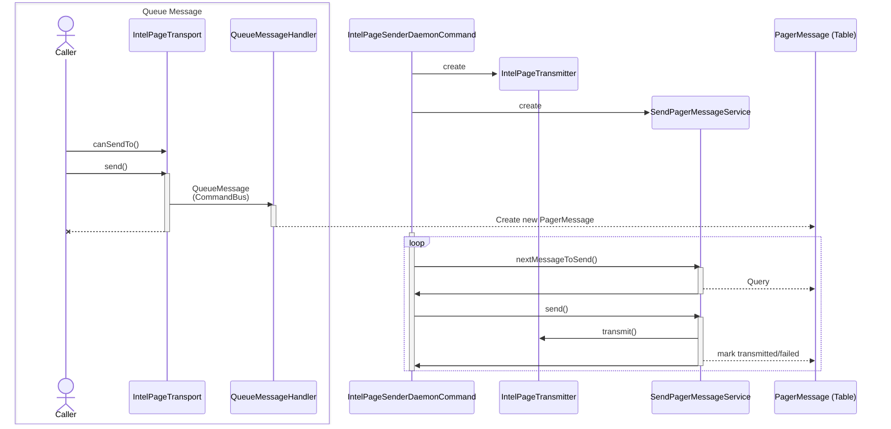

# IntelPage Transport

The IntelPage transport sends messages to an IntelPage appliance to be received by analogue radio pager.
Due to limitations of the hardware / radio protocol the transport queues messages to be sent.

## Design
The `IntelPageTransport` takes a message, extracts the correct message configuration for the given recipient and queues the message via the `QueueMessageHandler`. The `PagerMessage` database table is used as the queue.
In parallel a sender daemon has to be started by running `ÌntelPageSenderDaemonCommand`. The daemon instantiates an `IntelpageTransmitter` and `SendPagerMessageService`. It starts a long-running loop that polls the database and transmits any queued messages.

The following diagram gives an overview of the involved participants:

## Configuration Options

### Per Transport:
- host (Default: value of intel_page.transmitter.host)
- port (Default: value of intel_page.transmitter.port)

### Environment / SymfonyConfig / Daemon Command Options:

The options are exposed through the INTEL_PAGE_TRANSMITTER_DSN environment variable.

- intel_page.transmitter.host
- intel_page.transmitter.port (Default: 6000)
- intel_page.seconds_between_messages (Default: 2)
- intel_page.seconds_after_error (Default: 2)
- intel_page.microseconds_after_no_new_message (Default: 500_000)

## Order of Message Transmission

The `SendPagerMessageService` through the contained DB query, prioritises the next message to be sent by (in order):

- Filter: Not exceeded retry limit
- Filter: Messages not older than 5 minutes 
- Order: Priority (Higher first)
- Order: queuedOn (Older first)